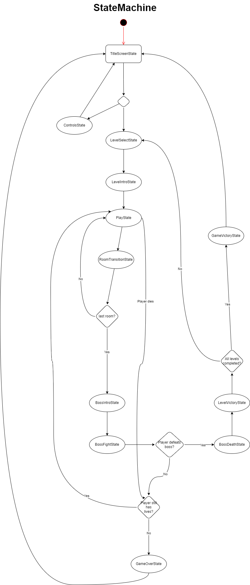
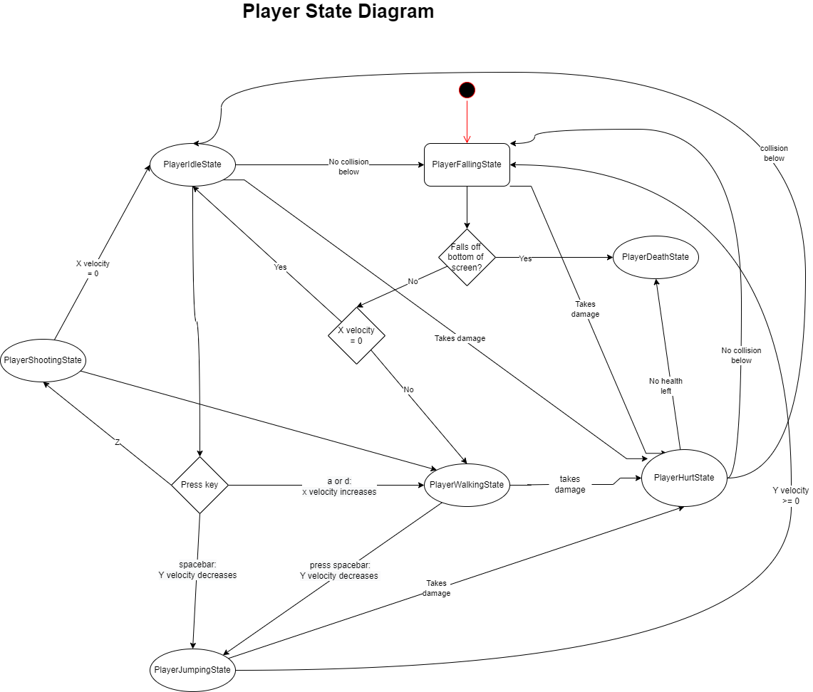
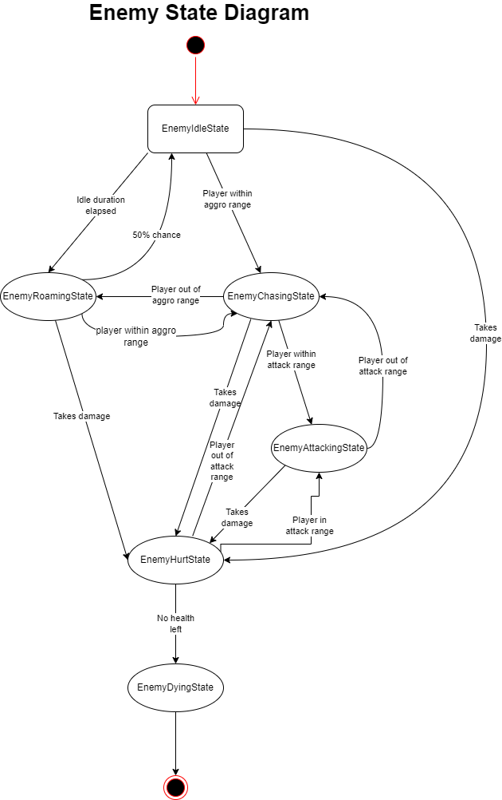
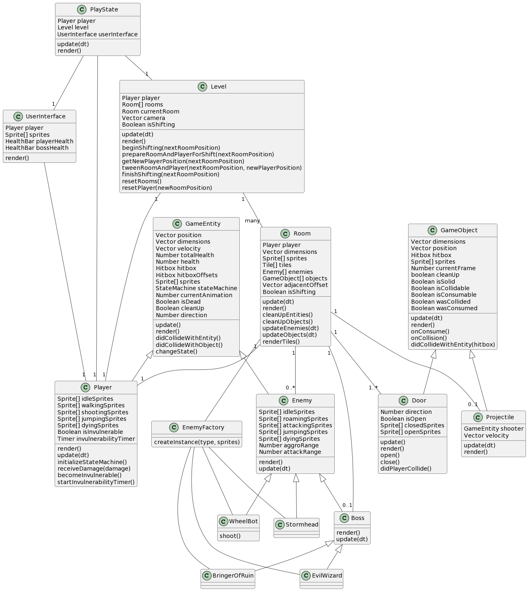
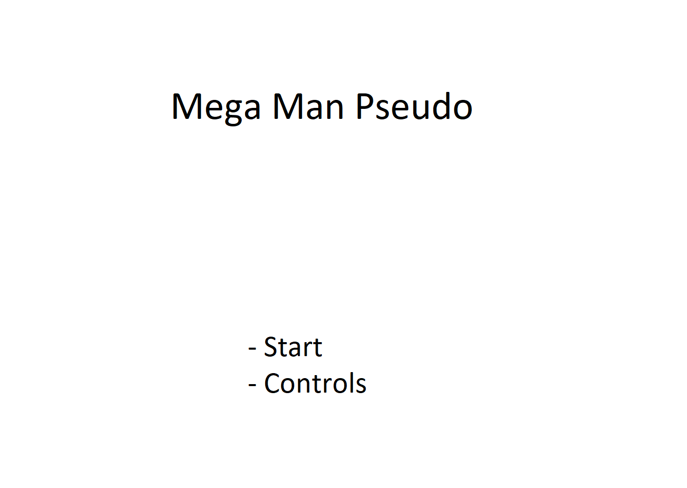
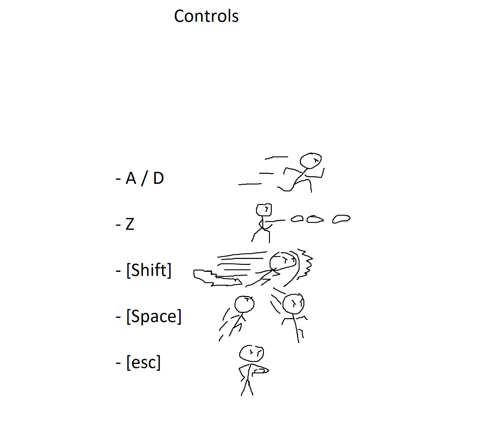
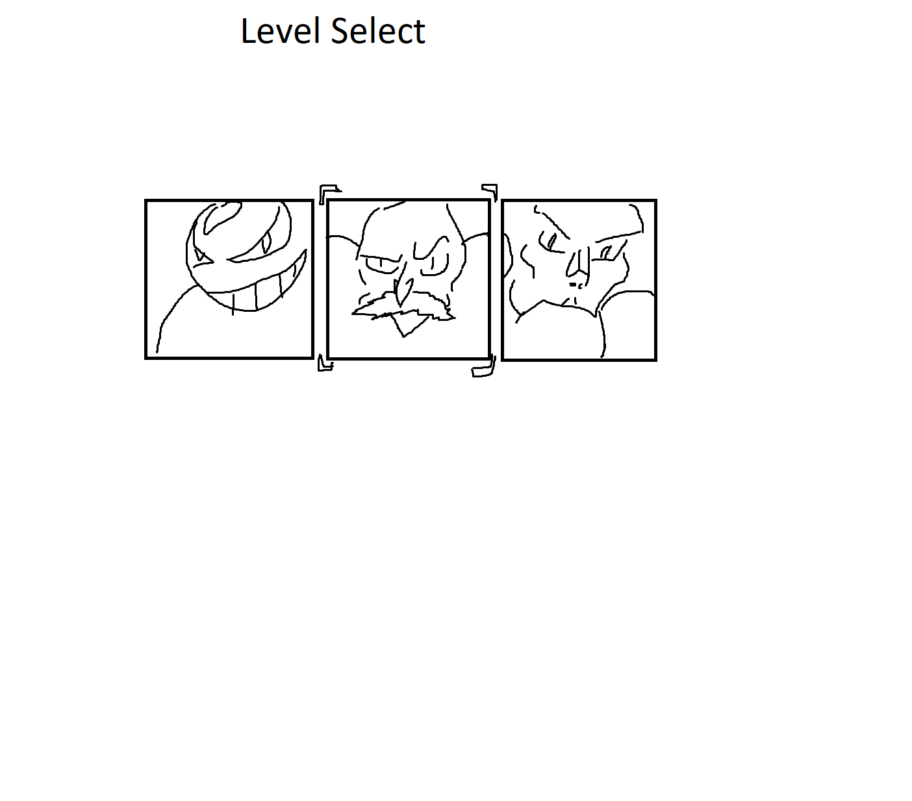
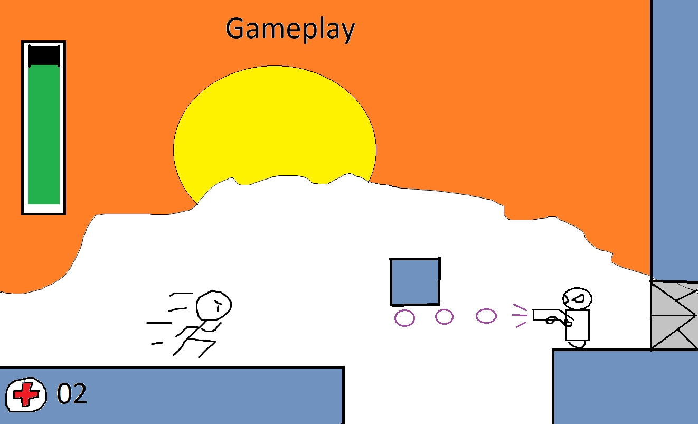

# Game Programing F22 Project - Mega Man Clone

By TheMegaMen (Evan Laverdiere Student ID #0860347)

## ✒️ Description

In this side-scrolling action game, players assume the role of an adventurer (to be determined) blasting their way through a fantasy/science-fiction world full of hostile enemies. The game is meant to have levels that are made of two or more rooms, with the goal of each level being to reach the final room and defeat the resident boss. The player wins if they defeat the level's boss, and loses if they die at any point during the level.

The concept and structure of the game takes heavy inspiration from the Mega Man franchise.

An optional feature that would be nice to have is for the player to gain new weapons/abilities upon defeating a boss and beating a level.

## 🕹️ Gameplay

Gameplay begins by allowing the player to select one of several levels in a level select screen. After a brief introductory sequence, the player enters the first room of the selected level. The player's goal is then to go right, attacking or avoiding enemies along the way until they reach a door at the far end of the current room. Upon touching this door, the player will be transferred into the next room of the level.

While they are in a level, the player is able to move left or right, jump, shoot, and dash over short distances. The player takes damage upon colliding with an enemy or a projectile fired by an enemy. The player can damage enemies by shooting them. The player character dies in any of the following conditions: their health is reduced to 0; they fall into a bottomless pit; or they come into contact with a hazardous substance, such as lava or a wall/floor of spikes.

Enemies will idle until the player comes within a certain distance of them. Once the player comes within this distance, the enemies will approach the player and attack. Enemies will take damage when shot by the player--that is, when they collide with a projectile fired by the player.

Each level has a single boss at the end, waiting in the level's final room. A boss behaves similarly to a normal enemy, but with more complex behavior and a greater amount of health.

If the boss is defeated, a special victory sequence will play in which the boss performs a death animation and disappears. The player will then warp out of the level, returning to the level select screen.

## 📃 Requirements

1. The user shall select a level to enter.
2. The player shall spawn into the level's first room.
3. The user shall proceed through the level.
4. The enemies shall attack the player upon detecting their presence.
5. The player shall lose health if it collides with an enemy or an enemy's projectile.
6. The player shall die and lose a life if they run out of health.
7. The enemies shall lose health if they collide with the player's projectiles.
8. The enemies shall die when they run out of health.
9. The player shall proceed to the next room of the level by touching a door.
10. The level shall play an animation transitioning the player from the current room to the next room when the above happens.
11. The final room of the level shall contain a boss.
12. The game shall play a brief introductory cutscene for the boss.
13. The boss shall attack the player aggressively.
14. The boss shall inflict damage to a player and take damage from them much as a normal enemy would.
15. The level shall pause the game to play a special victory sequence when the boss is defeated.
16. The player shall return to the level select scren once this victory sequence has finished.
17. A completed level shall have some sort of indicator on the level select screen to show that it has been completed: for example, the level's icon is greyed out.
18. The game shall display a victory screen once the player has beaten all levels.

### 🤖 State Diagram

### 🗺️ Class Diagram

### 🧵 Wireframes

- _Start_ will bring the player to the level select screen.
- _Controls_ will take the player to a screen demonstrating the game's control scheme.

Displays the game's control scheme.
- A and D moves the player left or right, respectively.
- Z makes the player shoot in whatever direction they're currently facing.
- Shift makes the player roll forward a short distance. While rolling, the player will not take damage from enemy attacks.
- Space makes the player jump.
- Escape pauses the game.

Lets the player select what level they want to play.

- Each portrait represents a different level within the game.
- Pressing A or D will move the cursor to the left or right.
- Pressing Enter will confirm the level selection, taking the player to the actual gameplay screen.

A typical example of the intended gameplay. In this image, the player races toward the right side of the screen while an enemy opens fire on them. The enemy stands in front of a door, which will take the player to the next room of the level.

The player has a health bar on the upper left side of the screen, which depletes as they take damage. When it is empty, they die. The number of lives remaining is indicated by a counter in the bottom left corner of the screen.

During boss fights, the boss will have a health meter on the upper right side of the screen so the player can tell how close they are to victory.

### 🎨 Assets

I used [apps.diagrams.net](https://app.diagrams.net/) to generate the state diagrams. The gameplay wireframes were drawn in Microsoft Paint. The Class Diagram was generated through [Plant UML](https://plantuml.com).

Game sprites and backgrounds were taken from various creators on [itch.io](https://itch.io/). The sprites used are freely available, and contributions for their use are given below:

- [Evil Wizard 2](https://luizmelo.itch.io/evil-wizard-2), by the user [LuizMelo](https://luizmelo.itch.io/), available under the Creative Commons Zero (CC-0) license;

- Bot Wheel (part of [Sci-fi Character Pack 12](https://penusbmic.itch.io/sci-fi-character-pack-12), by the user [Penusbmic](https://penusbmic.itch.io/));

- Stormhead Droid (part of [Sci-fi Character Pack 8](https://penusbmic.itch.io/sci-fi-character-pack-8), by the user [Penusbmic](https://penusbmic.itch.io/));

- [Arcane archer animated pixel character](https://astrobob.itch.io/arcane-archer), by the user [AstroBob](https://astrobob.itch.io/); 

- [Bringer of Death (Free)](https://clembod.itch.io/bringer-of-death-free), by the user [Clembod](https://clembod.itch.io/);

- [Industrial Parallax Background](https://ansimuz.itch.io/industrial-parallax-background), by the user [ansimuz](https://ansimuz.itch.io/);

- [Bulkhead Walls Environment](https://ansimuz.itch.io/bulkhead-walls-environment), by the user [ansimuz](https://ansimuz.itch.io/);

- [Ruins Tileset](https://penusbmic.itch.io/free-dungeon-ruins-tileset), by Penusbmic](https://penusbmic.itch.io/));

- [Amarelo](https://adamatomic.itch.io/amarelo), by [Adam Saltsman](https://adamatomic.itch.io/);

- [Free - Action Pack - CITY](https://anokolisa.itch.io/action), by [Anokolisa](https://anokolisa.itch.io/);

#### 🖼️ Images

All background images that I am using come from the [itch.io](https://itch.io/) assets listed above.

#### ✏️ Fonts

- [Joystix](https://www.dafont.com/joystix.font)
- [Mega Man ZX](https://www.dafont.com/mega-man-zx.font)

#### 🔊 Sounds

With one exception, all music tracks and sound effects were taken from [freesound](https://freesound.org/).

- "Industrial Theme Music", part of the [Industrial Parallax Background](https://ansimuz.itch.io/industrial-parallax-background) pack by [ansimuz](https://ansimuz.itch.io/);

- ["Boss Stage"](https://freesound.org/people/FoolBoyMedia/sounds/271340/), by the freesound user [FoolBoyMedia](https://freesound.org/people/FoolBoyMedia/);

- [fight.wav](https://freesound.org/people/Xythe/sounds/100877/), by the freesound user [Xythe](https://freesound.org/people/Xythe/);

- ["Laser"](https://freesound.org/people/Daleonfire/sounds/376694/), by the freesound user [Daleonfire](https://freesound.org/people/Daleonfire/);

- ["Damage"](https://freesound.org/people/qubodup/sounds/211634/), by freesound user [qubodup](https://freesound.org/people/qubodup/);

- ["SCI-FI_DOOR_2"](https://freesound.org/people/alexo400/sounds/543654/), by freesound user [alexo400](https://freesound.org/people/alexo400/);

- ["Kill Enemy 2 8 Bit.wav"](https://freesound.org/people/Mrthenoronha/sounds/506587/), by freesound user [Mrthenoronha](https://freesound.org/people/Mrthenoronha/);

- ["Victory Sound 1.wav"](https://freesound.org/people/SilverIllusionist/sounds/462250/), by freesound user [SilverIllusionist](https://freesound.org/people/SilverIllusionist/);

- ["Body fall_02.wav](https://freesound.org/people/deleted_user_2104797/sounds/346694/) by freesound user [deleted_user_2104797](https://freesound.org/people/deleted_user_2104797/).

- ["Fire 2 8 Bit.wav"](https://freesound.org/people/Mrthenoronha/sounds/508834/) by freesound user [Mrthenoronha](https://freesound.org/people/Mrthenoronha/);

- ["Laser Shot Big 4"](https://freesound.org/people/bubaproducer/sounds/151020/) by freesound user [bubaproducer](https://freesound.org/people/bubaproducer/);

- ["Electrical Shock (Zap).wav"](https://freesound.org/people/BigKahuna360/sounds/160421/) by freesound user [BigKahuna360](https://freesound.org/people/BigKahuna360/);

- ["Electric zap.wav"](https://freesound.org/people/michael_grinnell/sounds/512471/) by freesound user [michael_grinnell](https://freesound.org/people/michael_grinnell/);

### 📚 References